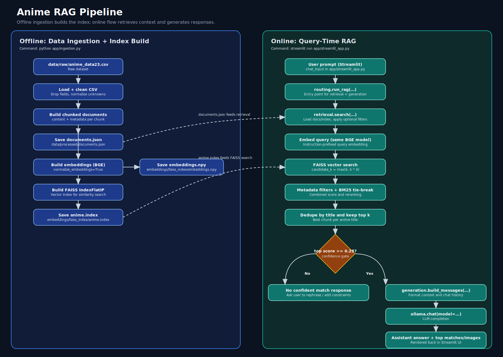

## Anime RAG

Anime RAG app for recommendations and factual lookup using a CSV dataset, chunked ingestion, FAISS vector search, a local Streamlit demo, and a deployable web app.

**Highlights**
- Chunked ingestion for better retrieval on long synopses
- FAISS vector search with optional BM25 tie‑breaker reranking
- Metadata stored alongside embeddings (genres, studio, score, etc.)
- Optional image rendering from `Image URL`
- Local Streamlit app for `Ollama`
- Deployable web app for `NVIDIA`

## Project Structure
- `app/ingestion.py` builds documents, embeddings, and FAISS index
- `app/retrieval.py` handles vector search, metadata filtering, and duplicate removal by title
- `app/routing.py` wires retrieval to the LLM
- `app/providers.py` contains the `Ollama` and `NVIDIA` adapters used by the two app entrypoints
- `app/streamlit_app.py` local Streamlit UI backed by `Ollama` and `.env.local`
- `app/web_server.py` FastAPI server for the deployable web UI backed by `NVIDIA` and `.env.web`
- `app/web_static/` static HTML, CSS, and JS for the deployable frontend
- `data/raw/anime_data23.csv` source dataset
- `data/processed/documents.json` generated documents
- `embeddings/faiss_index/` FAISS index + embeddings

## Pipeline Flowchart


## Setup
Create a virtual environment and install dependencies:

```bash
python -m venv anime
source anime/bin/activate
pip install -r requirements.txt
```

For local/offline generation, install and run Ollama. Suggested local models:

- `phi3:mini`
- `deepseek-llm:7b-chat`
- `qwen:7b`
- `mistral:7b-instruct-v0.3-q4_0`
- `llama3.1:8b`

```bash
ollama pull llama3.1:8b
ollama serve
```

Use the env files at the repo root:

- `.env.local` for the Streamlit + Ollama app
- `.env.web` for the FastAPI + NVIDIA web app
- `.env.local.example` and `.env.web.example` as safe templates
- The default hosted model in `.env.web` is `moonshotai/kimi-k2-instruct`

## Ingest Data (Build Index)
This reads the CSV, chunks synopsis text, builds embeddings, and writes the FAISS index.

```bash
python app/ingestion.py
```

## Run Local Streamlit App
```bash
source anime/bin/activate
streamlit run app/streamlit_app.py
```

## Run Deployable Web App
This serves the custom web UI backed by the NVIDIA provider.

```bash
source anime/bin/activate
uvicorn web_server:app --app-dir app --reload
```

Then open [http://localhost:8000](http://localhost:8000).

## Deploy On Render
This repo includes a [render.yaml](/Users/sahil/Documents/GitHub/ANime-RAG/render.yaml) blueprint plus build/start scripts in [scripts/render-build.sh](/Users/sahil/Documents/GitHub/ANime-RAG/scripts/render-build.sh) and [scripts/render-start.sh](/Users/sahil/Documents/GitHub/ANime-RAG/scripts/render-start.sh).

Render should be configured with:
- `NVIDIA_API_KEY` as a secret env var
- `LLM_PROVIDER=nvidia`
- `NVIDIA_MODEL=moonshotai/kimi-k2-instruct`
- `NVIDIA_BASE_URL=https://integrate.api.nvidia.com/v1`

The build step regenerates `data/processed/documents.json` and the FAISS index because those artifacts are ignored in git.

## App Split
- `streamlit_app.py`: local showcase app, fixed to `Ollama`
- `web_server.py`: deployable app, fixed to `NVIDIA`
- Retrieval remains local in both modes unless you later move embeddings to an API or vector database

## How Retrieval Works
- Each anime becomes one or more **chunked documents**.
- Embeddings are built from `content` only.
- Metadata is stored separately and can be used for filtering.
- Results remove duplicate matches by title to avoid multiple chunks of the same anime.
- A lightweight BM25 scorer is used as a tie‑breaker.
- If the top score is too low, the app returns a “no confident match” response.

## Chunking Settings
Edit these in `app/ingestion.py` if you want to change chunk size and overlap:

```
CHUNK_SIZE_CHARS = 1000
CHUNK_OVERLAP_CHARS = 150
```

Re‑run ingestion after changing these values.

## Image Support
If your CSV has an `Image URL` column, the UI can display posters for retrieved titles.
Toggle this in the sidebar.

## Metadata Filtering
`app/retrieval.py` supports filters like:

```
filters = {
  "genres": ["Action", "Adventure"],
  "studio": "Bones",
  "type": "TV",
  "min_score": 7.5,
  "min_episodes": 12,
  "max_episodes": 26,
}
```

You can wire these into the UI if needed.

## Notes
- If you update `data/raw/anime_data23.csv`, re‑run `python app/ingestion.py`.
- Large models will require more RAM/VRAM depending on your machine.
- If you later switch the embedding model, rebuild the FAISS index so retrieval stays consistent.
